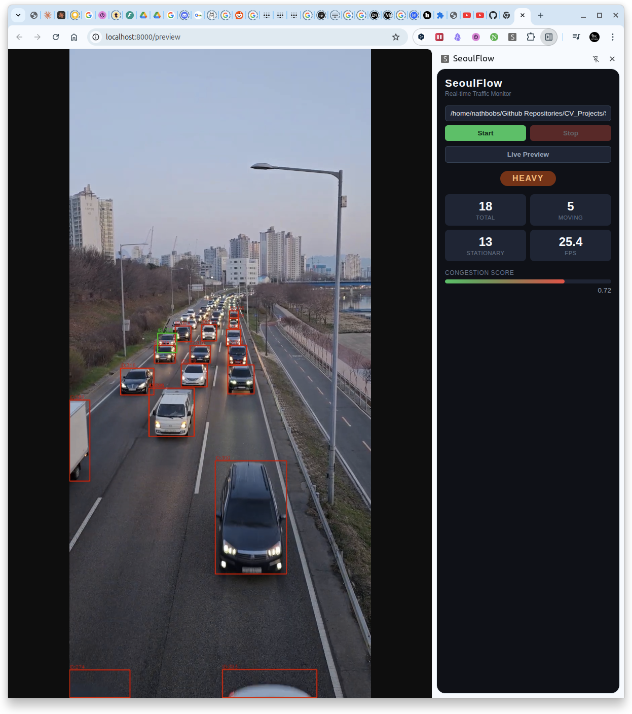
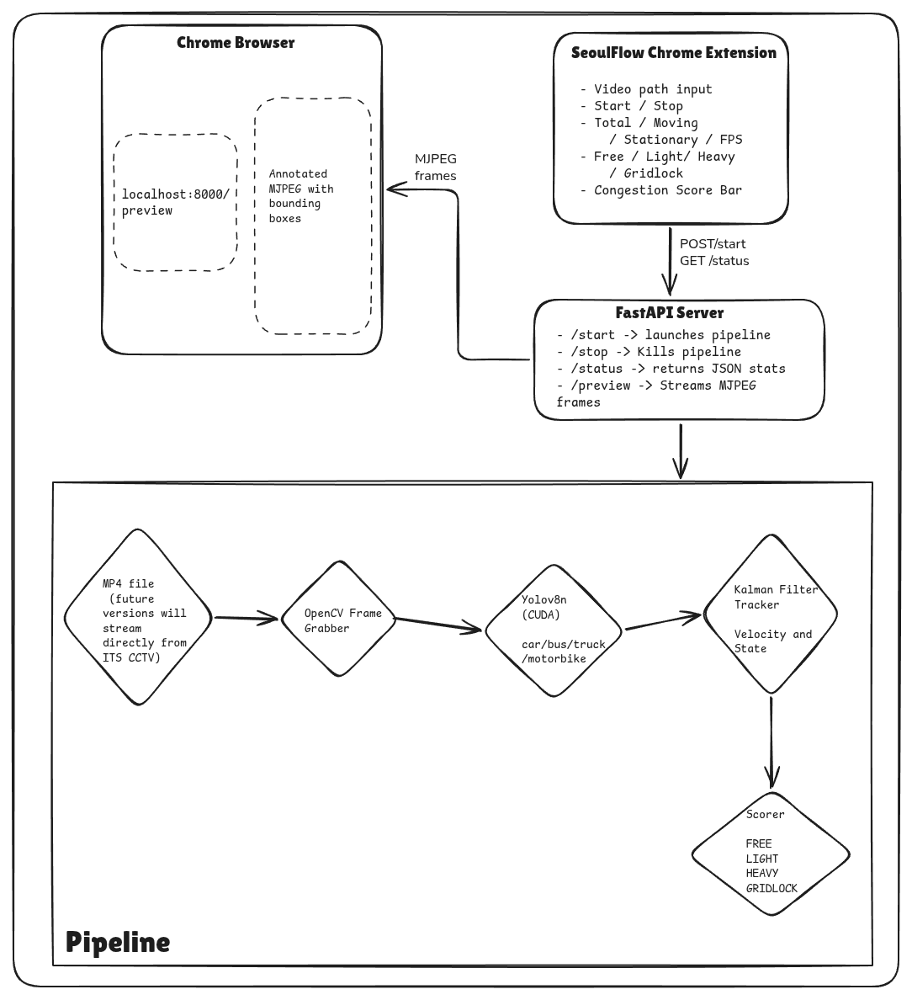

# SeoulFlow


Real-time traffic congestion monitoring in Seoul South Korea, using computer vision. Vehicle detection and Kalman Filter tracking on live CCTV footage via a Chrome extension sidebar.

---

## Demo

<p align="center">
  
  &nbsp;
  
</p>

---

## Architecture

<p align="center">
  
</p>

---

## Features

- Real-time vehicle detection via YOLOv8x (cars, motorcycles, buses, trucks)
- Kalman Filter tracking with persistent vehicle IDs across frames
- Four congestion states: **FREE** - **LIGHT** - **HEAVY** - **GRIDLOCK**
- CUDA-accelerated inference on NVIDIA GPUs
- Chrome extension sidebar with live stats and congestion badge
- MJPEG annotated preview stream in a dedicated browser tab

---

## How It Works

```
Frame Grab  →  YOLOv8 Inference  →  Kalman Filter Tracking  →  Congestion Scoring
   (OpenCV)       (CUDA, conf 0.25)     (filterpy, IoU match)       (stationary ratio)
```

1. **Frame Grab** — OpenCV reads each frame from the video source
2. **YOLOv8 Inference** — detects vehicles with class filtering and confidence threshold
3. **Kalman Filter Tracking** — assigns persistent IDs, estimates velocity, flags stationary vehicles
4. **Congestion Scoring** — computes stationary ratio and maps it to a congestion level

---

## Getting Started

### Prerequisites

- Python 3.11+
- NVIDIA GPU with CUDA (CPU fallback supported)
- Google Chrome

### Clone

```bash
git clone https://github.com/nathbobs/SeoulFlow.git
cd SeoulFlow
```

### Install dependencies

```bash
pip install -r requirements.txt
```

### Run the backend

```bash
cd backend
uvicorn main:app --reload
```

The server starts at `http://localhost:8000`. On first run, YOLOv8x weights (~130 MB) are downloaded automatically.

### Load the Chrome extension

1. Open `chrome://extensions`
2. Enable **Developer mode** (top-right toggle)
3. Click **Load unpacked** and select the `extension/` folder
4. Click the SeoulFlow icon in the toolbar to open the sidebar
5. Enter your video path (e.g. `videos/test.mp4`) and press **Start**

---

