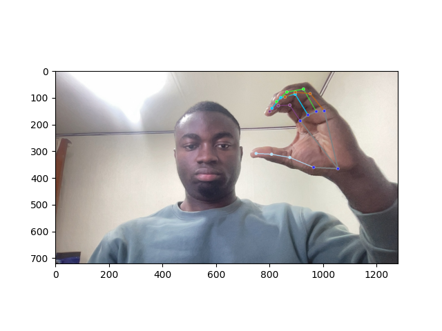
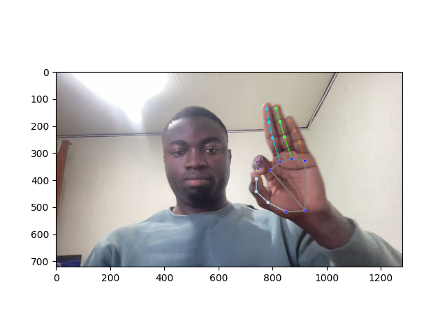
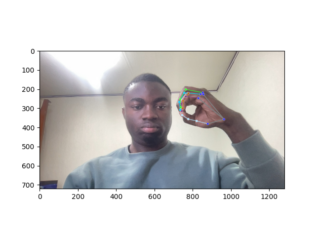

# Sign Language Detection  

## Table of Contents  
- [About](#about)  
- [Technologies](#technologies)  
- [Prerequisites](#prerequisites)  
- [Features](#features)  
- [Demo](#demo)  
- [Issues and Next Steps](#issues-and-next-steps)  

---

## About  
This project aims to detect and classify **sign language gestures** using **machine learning** and **computer vision**.  

---

## Technologies  
- **Python 3.8+**  
- **OpenCV**  
- **MediaPipe**  
- **Scikit-Learn**  

---
## Features

✨ Hand Landmark Detection using MediaPipe.
✨ Multi-Class Classification with Random Forest Classifier.
✨ Custom Dataset Collection for training gestures.

---
## Demo
### Landmark Detection Example

  
  
  

### Model Prediction Example

  

---
## Issues 🚧

### Current Issue:
	•	The model often predicts **'your'** for most gestures, failing to differentiate between inputs.
